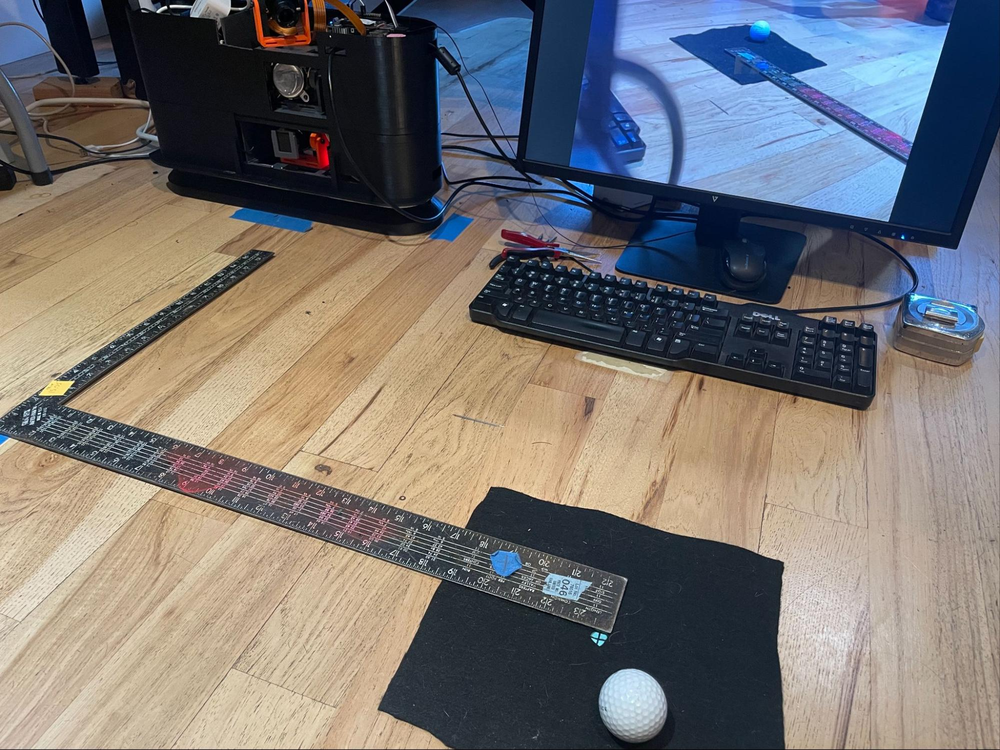
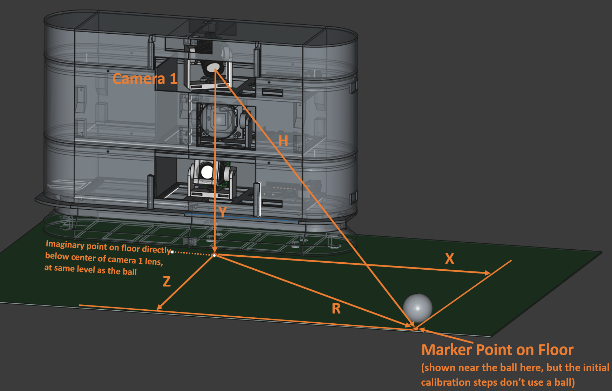
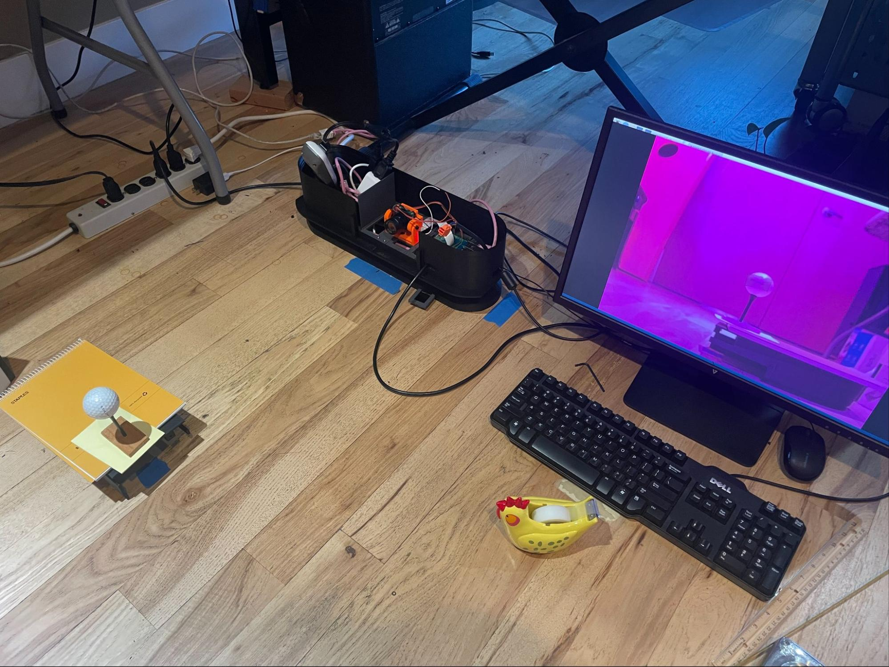
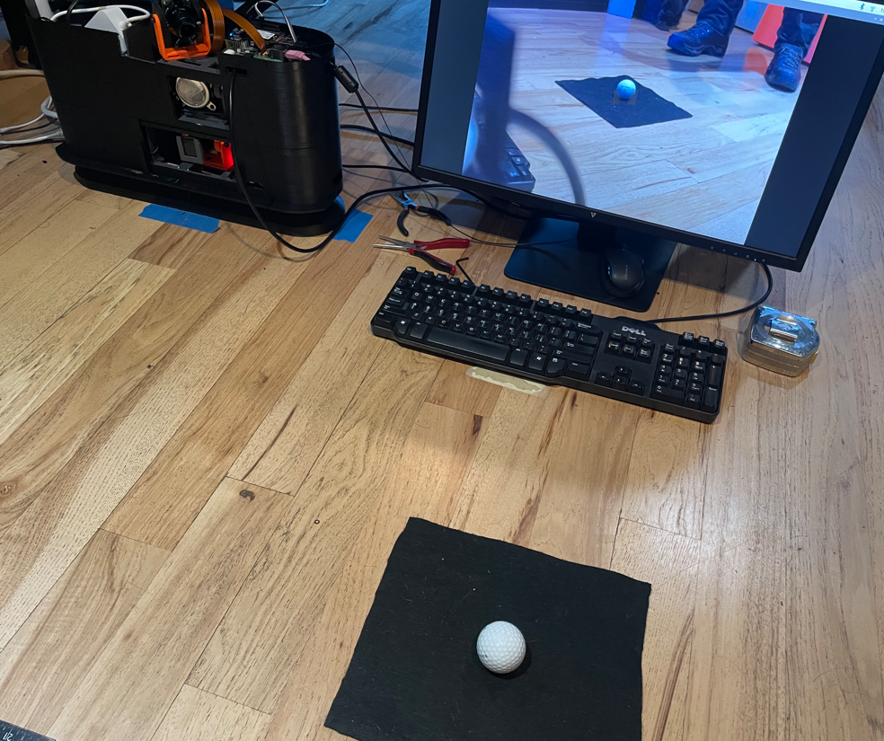

## Tee Camera (Top Camera)

Tee camera distances and angles (also referenced by and relevant for Flight camera process)  

1. Only for Tee camera, plug in the exterior LED strip at the bottom of the launch monitor. For these calibration steps, the more light the better.  
2. Start the `previewGS.sh` script (which runs libcamera.hello) for Tee camera, or `previewGS_noir.sh` script for Flight camera.  This will allow you to see the marker in real time as the camera is positioned and focused.  
3. Pick an appropriate nominal tee-up spot to use as the calibration marker point for flight camera.  The exact placement is not important, but positioning the ball near where it will be teed should help make the calibration more accurate.  
   1. Typical is `60cm` to the right and around `50-60cm` in front of the LM (looking at the LM from where the player would stand, looking down into its cameras). Other distances can work as well, but the balance is between being close enough to get a good view of the ball, and far enough that the field of view is sufficiently broad to capture enough (at least 4) image imprints as the strobe light fires.
4. Use a tape measure to accurately determine the position from the front-center of the LM to the point where the ball will be expected to be teed up as follows:  
   1. Note - The ball will likely be right in front of Flight camera (and a `10-20cm` in the air), but for Tee camera, it will be a couple feet to the right and on the ground.  
   2. Further back (to the right of the LM for right-handed golfers) gives more time for the LM to “see” a fast ball in the Flight camera before it goes too far.  The LM should be able to operate regardless of exactly where the marker point is, but a point close to the typical tee-off makes the calibration in that area more accurate.  
   3. Place a marker (e.g., a sticky-note with a `3mm` dot or crosshair) at the point on the ground where the nominal tee point will be.  If you are calibrating on a hitting mat. A short bit of wire insulation pushed into the hitting mat works well, too.  The point just has to be well enough marked to be able to see it in the center of the preview screen.  
   4. Tee camera Example Setup:  
      - 
5. Loosen and then move the camera mount until the preview screen on the monitor shows the marker dot directly behind the taped-on dot on the monitor.  The idea is to center the marker in the camera view so that the camera is known to be aimed directly at the spot.  Continue to keep the point centered as you tighten the gimbal screws (a small 90-degree M4 hex wrench makes this easier).  
   1. **NOTE** - Sometimes the mount is sticky and only wants to point to a particular point near, but not at the marker.  In that case, let the camera do what it wants to do, and just re-measure where the point is (it might be a few millimeters one way or the other), and then use those measurements, below.  
   2. When tightening the base of the Pi for Tee camera (top floor), you may have to loosen and move the strobe light that is immediately below the camera to get room to use a needle-nose pliers to tighten the bold.   
6. Measure the following distances from the camera being calibrated to the marker. **NOTE** these values have slightly different definitions for Flight camera. Reference that process elsewhere in this document when calibrating that camera.  
   1. Refer to the following diagram regarding the necessary calibration measurements for Tee camera:  
   2.  
   3. X is distance to the right of the LM (facing the LM as a right-handed golfer) to the marker point  
      1. `X = .60` (typical) (distances here are in meters)  
      2. For Flight camera, the X should reflect the effective X-axis difference between the two cameras (because Tee camera is twisted to one side from center). So, even if the Flight camera is centered, it’s X is likely to be 3 or 4 cm.  
      3. The “Origin” referenced in the .json file (e.g., `kCamera1PositionsFromOriginMeters` is technically arbitrary, but this system considers it as the point on the floor directly below where the Tee camera (or Flight camera) is focused.  
   4. Y is the distance from the middle of the Tee camera lens to the level of the hitting mat (for Tee camera) or the aiming point (for Flight camera).  
      1. `Y = .275` (typical)    
   5. Z is the distance straight out from the front of the LM unit to the plane of the marker  
      1. `Z = .56` 
   6. R is the distance from the point on the floor directly below the front center of the camera lens to the marker point on the floor (see diagram above).  This is one side of a triangle, with the other two sides being the line from the camera to the point on the floor, and the third side as “H”, below.  
      1. `R = .83`  
      2. NOTE - because of the tilt angle of Tee camera, the point on the floor will technically be hidden below the base of the LM.  Usually, we just measure from the edge of the base and add the additional couple of centimeters to make up for the offset.  For the same reason, the X distance on the floor for that camera will be a few centimeters less than the same point would be for Flight camera   
   7. H is the distance from the camera lens direct (as the crow flies) to the marker point  
      1. `H = .87`  
   8. Set the X, Y and Z values in the configuration .JSON file: (below values are typical)  
      1. (in “cameras” section) `"kCamera1PositionsFromOriginMeters": [ <X>, <Y>, <Z> ]` for example, `[0.60, 0.275, 0.56 ]`,   (x,y and z in cm), and  
      2. `"kCamera1Angles": [ <XDeg>, <YDeg> ]`, for example, `[46.97, -17.44]`  (from spreadsheet)  
7. Determine the camera’s focal length  
   1. Place a ball on or at the marker.    
      1. For Tee camera, the ball will be immediately above the marker.    
      2. For Flight camera, create a support that will hold the ball so that its center in space is where the marker point existed in space before it was replaced by an actual ball.  Put the   
      3. Example setups:  Flight camera:  
      4.  
      5. Tee camera:  
      6.  
   2. Ensure that the area around the ball has good contrast.  For example, put down some black felt around the ball or use a white ball on a green hitting mat.   
   3. For Tee camera, turn the LED strip on the LM base on to make sure there’s sufficient light for good exposures.  
   4. Re-Measure H to ensure it’s correct - it is the distance on a line straight out from the camera lens to the ball center (at or near where the marker point was)  
   5. Set the H distance into the appropriate parameter in the “calibration” section of the `golf_sim_config.json` file:   
      1. For Tee camera, `"kCamera1CalibrationDistanceToBall"`.  `~87cm` is typical   
      2. For Flight camera, `"kCamera2CalibrationDistanceToBall"`. `~55cm` is typical  
   6. For Flight camera, install the light filter and holder on the lens.  
   7. Focus the lens as well as possible and lock in the focus by tightening the thumb screw closest to the camera (the other screw should already have been tightened).  Using the brand-marking or number printed on the ball can help this process.  This will establish the focal distance in the next step.  
   8. IF NOT ALREADY DONE AT LEAST ONCE, PERFORM CAMERA LENS UNDISTORTION PROCESS (other section) 
   9. Ensure the ball is well-lit, especially near its bottom.  
      1. For Flight camera, getting as much sunlight in as possible can help provide sufficient IR to see well, or an incandescent light can also help.  
   10. Run the `“runCam1Calibration.sh”` or `“runCam2Calibration.sh”` script to get the focal length.    
         1. It will take multiple measurements and average them.  This will take a minute or so.  
   11. Set the resulting focal length into the .JSON file.    
         1. E.g., `"kCamera1FocalLength": 5.216` would be typical  
8. Determine the x & y (pan and tilt) camera1 angles for the configuration .JSON file  
   1. [See [https://docs.google.com/spreadsheets/d/1igc2V7oq-hGpFP5AKGjyzc2osLVpYHp969iPyHGttJ8/edit\#gid=423758471](https://docs.google.com/spreadsheets/d/1igc2V7oq-hGpFP5AKGjyzc2osLVpYHp969iPyHGttJ8/edit#gid=423758471) for automatic calculations]  
   2. X/pan is positive as the camera twists to face back to where the ball is teed (as the camera goes counter-clockwise viewed from above the LM).    
   3. Y/tilt  is negative as the camera starts to face down.   
   4. The angles are measured from the bore of the camera if it were facing straight out at no angle and level with the ground  
   5. XDeg = 90 - atan(Z/X)   YDeg = -(90 - asin(R/H))   OR, for camera2, YDeg = ATan(Y/R), e.g, atan(4.5/40) = 6.42.   
      1. For example, for Tee camera:  
         1. `XDeg = 56.31 , YDeg = -24.46`  
      2. For example, for Flight camera:  
         1. `X = -0.03  Y = 0.13  Z = 0.40 H = 0.42  R =`    
   6. Set the values in the configuration .JSON file:  
      1. (in “cameras” section) `"kCamera1Angles": [ 54.7, -22.2 ]`,   (x,y  or pan, tilt)  
9. Place a ball ball near the mark on the tee-up spot so that there is a straight line from the camera to the mark that runs through the center of the ball (thus the ball will be slightly in front of the marker)  
10. Measure the distances to the center of the ball  
11. In the JSON file, set calibration.kCamera1CalibrationDistanceToBall to the distance to the ball in meters, e.g,. 0.81   
12. Run `“runCam1BallLocation.sh”` script to make sure the angles and distances and processing are correct  
      1. The ball-search location should work in the center:   `--search_center_x 723 --search_center_y 544`. If the script doesn’t return values, check the `log_view_final_search_image_for_Hough.png` file.  
      2. Remember, that the distances will be approximately to the center of the ball FROM THE CAMERA, so will be a little shorter than the distance to the LM in the X direction. 
        
----